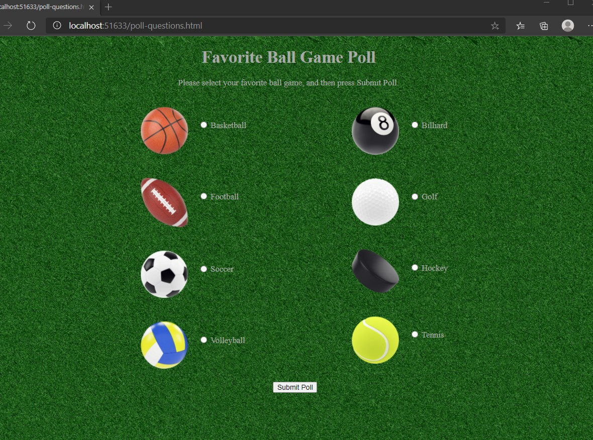

# Module 3: Configuring Middleware and Services in ASP.NET Core

## Lab: Configuring Middleware and Services in ASP.NET Core 

1. **Nombres y apellidos:** Francisco Javier Moreno Quevedo
2. **Fecha:** 06/12/2020
3. **Resumen del Ejercicio:**  Añadir los componentes necesarios para hacer funcional la aplicacion 1/4
4. **Dificultad o problemas presentados y como se resolvieron:** Ninguna


- Ejercicio 1: Working with Static Files.

  - Creamos un nuevo proyecto **ASP.NET Core Web Application**
  - En el middleware añadimos el metodo configure

  ```cs
      public void Configure(IApplicationBuilder app)
      {
          app.Run(async (context) =>
          {
               await context.Response.WriteAsync("This text was generated by the app.Run middleware.");
          });
      }
  ```

  - Añadimos los ficheros preseleccionados del ejercicio en el **wwwroot**
- Creamos una pagina HTML en el **wwwroot** que llamaremos **poll-questions** y añadimos el codigo
  - Ejecutamos y comprobamos que esa pagina no aparece
- Añadimos en el  middleware en el metodo configure:
  
  ```cs
      app.UseStaticFiles();
  ```
  
  - añadimos la hoja de estilos en la pagina **poll-questions.html**
  - Ejecutamos y comprobamos el aspecto
  
  
  
  

